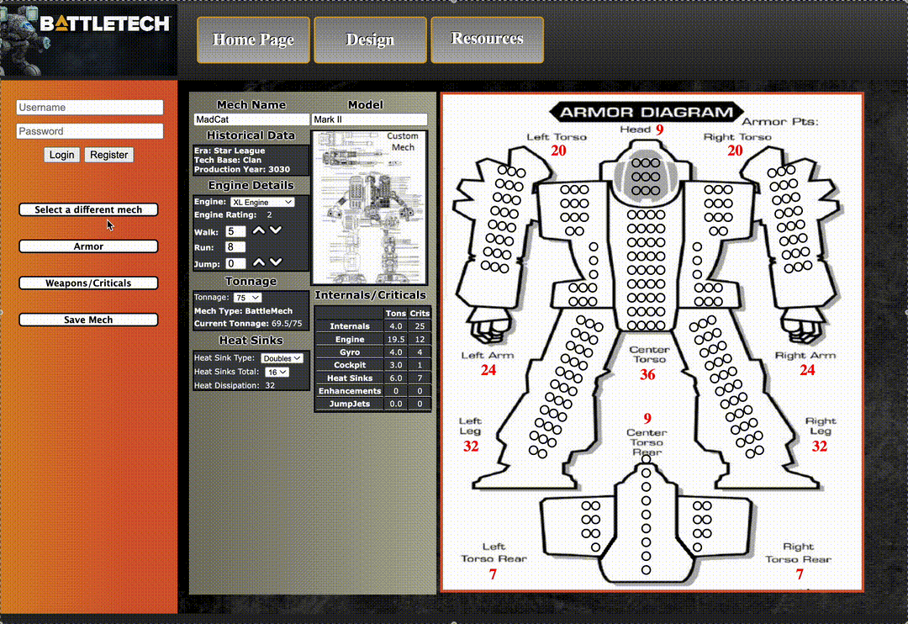

# MechDesign

This project is a site developed in Node JS to allow players of the board game "BattleTech" to customize and design their mechs. Utilizes Express Routing, MongoDB, Pug, and SASS styling as an alternative to more traditional LAMP stacks

# Overview

The first site was handled in php and javascript and worked well enough but I would like this site to have improved functionality and also explore different options using MongoDB and Node JS.

### Getting Started



### Dependencies

-   Docker Desktop

### Installing

-   cp .env.example .env (modify as needed)
-   docker compose down -v
-   docker compose build --no-cache
-   docker compose up -d

### Executing program

-   Navigate to your local browser
-   Step-by-step guide below

```
Navigate to http://localhost:3000/

Save once you customized your mech
```

## Authors

[@NateThurmond](https://github.com/NateThurmond)

## Version History

-   0.4
    -   Add full mongodb integration on backend
-   0.3
    -   Final buildout includes all routes and scripts needed for future dev.
    -   Includes init DB scripts so anyone can spin up application
-   0.2
    -   Switch over to .pug templating from .jade
    -   See [commit change]() or See [release history]()
-   0.1
    -   Initial Development

## License

This project is licensed under the Apache License, Version 2.0

## Acknowledgments

Inspiration, code snippets, etc.

-   [Camo Specs](https://camospecs.com/)
-   [Solaris Skunk Werks](https://solarisskunkwerks.com/)
-   [BattleTech](https://www.battletech.com/)
